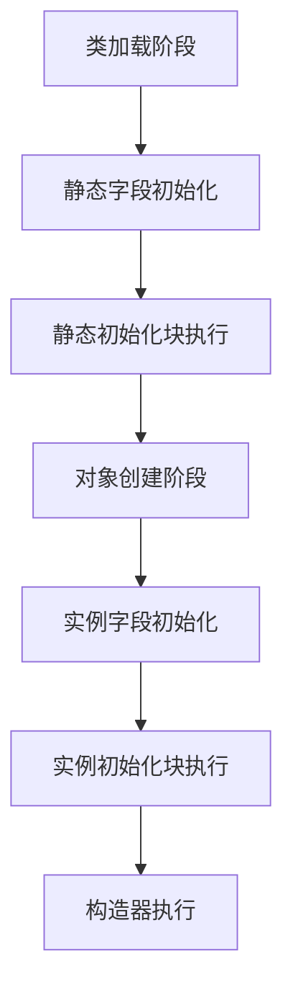

# Java 代码块核心笔记

## 一、代码块类型概览

| 代码块类型         | 关键字       | 执行时机               | 执行次数 | 主要用途                     |
|--------------------|-------------|------------------------|----------|------------------------------|
| 局部代码块         | 无          | 方法调用时             | 多次     | 控制变量作用域               |
| 实例初始化块       | 无          | 对象创建时             | 每次创建 | 对象初始化逻辑               |
| **静态初始化块**   | `static`    | 类加载时               | **仅一次** | 静态资源初始化              |
| 同步代码块         | `synchronized` | 线程进入时           | 多次     | 线程安全控制                 |

## 二、局部代码块（普通代码块）

### 特性与用法
```java
public void demoMethod() {
    // 方法级变量
    int outer = 10;
    
    { // 局部代码块开始
        // 块级变量（作用域仅限于代码块内）
        int inner = 20;
        System.out.println("Inner block: " + (outer + inner));
    } // 局部代码块结束
    
    // System.out.println(inner); ❌ 编译错误 - inner不可访问
}
```

### 核心特点：
- **作用域控制**：限制变量生命周期
- **内存优化**：及时释放不再使用的变量
- **逻辑分组**：将相关操作组织在一起

## 三、实例初始化块（构造代码块）

### 特性与用法
```java
class MyClass {
    private int value;
    
    // 实例初始化块1
    {
        System.out.println("First instance init block");
        value = 5; // 初始化字段
    }
    
    // 实例初始化块2
    {
        System.out.println("Second instance init block");
        value *= 2; // 修改字段值
    }
    
    public MyClass() {
        System.out.println("Constructor: value = " + value);
    }
}

// 测试：
// new MyClass() 输出：
// First instance init block
// Second instance init block
// Constructor: value = 10
```

### 执行规则：
1. 按**声明顺序**执行所有实例初始化块
2. 在**构造器执行前**自动调用
3. **每次创建对象**时都会执行

### 与构造器的关系：
```java
class InitExample {
    // 初始化块 → 构造器
    { System.out.println("Init block"); }
    
    public InitExample() {
        System.out.println("Constructor");
    }
}
```

## 四、静态初始化块（类初始化块）

### 特性与用法
```java
class DatabaseConfig {
    // 静态字段
    private static String url;
    private static String username;
    
    // 静态初始化块
    static {
        System.out.println("Static block executing...");
        // 加载配置文件
        Properties props = loadConfig();
        url = props.getProperty("db.url");
        username = props.getProperty("db.user");
    }
    
    public static void connect() {
        System.out.println("Connecting to: " + url);
    }
}

// 测试：
// DatabaseConfig.connect(); 
// 输出: Static block executing...
//       Connecting to: jdbc:mysql://localhost:3306/mydb
```

### 核心特点：
- **类加载时执行**（首次使用类时）
- **仅执行一次**
- 用于初始化**静态资源**（配置、连接池等）

### 多个静态块的执行：
```java
class MultiStatic {
    static { System.out.println("Static block 1"); }
    static { System.out.println("Static block 2"); }
    
    // 输出顺序：1 → 2（按声明顺序执行）
}
```

## 五、同步代码块（线程安全）

### 特性与用法
```java
class Counter {
    private int count = 0;
    private final Object lock = new Object();
    
    public void increment() {
        // 同步代码块（使用自定义锁对象）
        synchronized(lock) {
            count++;
        }
    }
    
    public int getCount() {
        // 同步代码块（使用this对象锁）
        synchronized(this) {
            return count;
        }
    }
}
```

### 核心特点：
- 保证**线程互斥访问**
- 需要指定**锁对象**（可以是任意对象实例）
- 减少同步范围，提高性能

## 六、代码块执行顺序

### 完整执行流程（类加载 → 对象创建）
```java
class ExecutionOrder {
    // 1. 静态字段初始化
    private static String staticField = initStaticField();
    
    // 2. 静态初始化块
    static {
        System.out.println("Static block");
    }
    
    // 3. 实例字段初始化
    private String instanceField = initInstanceField();
    
    // 4. 实例初始化块
    {
        System.out.println("Instance block");
    }
    
    // 5. 构造器
    public ExecutionOrder() {
        System.out.println("Constructor");
    }
    
    // 辅助方法
    private static String initStaticField() {
        System.out.println("Static field init");
        return "static";
    }
    
    private String initInstanceField() {
        System.out.println("Instance field init");
        return "instance";
    }
}

/*
执行 new ExecutionOrder() 输出：
1. Static field init
2. Static block
3. Instance field init
4. Instance block
5. Constructor
*/
```

### 类加载与对象创建流程：


## 七、特殊应用场景

### 1. 单例模式的双重检查锁
```java
class Singleton {
    private static volatile Singleton instance;
    
    private Singleton() {}
    
    public static Singleton getInstance() {
        if(instance == null) {
            synchronized(Singleton.class) { // 同步代码块
                if(instance == null) {
                    instance = new Singleton();
                }
            }
        }
        return instance;
    }
}
```

### 2. 匿名内部类初始化
```java
Runnable task = new Runnable() {
    // 实例初始化块（匿名内部类）
    {
        System.out.println("Anonymous inner class init");
    }
    
    @Override
    public void run() {
        // 执行逻辑
    }
};
```

### 3. 静态工具类初始化
```java
final class MathUtils {
    private static final double PI;
    
    // 静态初始化块
    static {
        PI = calculatePi();
    }
    
    private MathUtils() {} // 防止实例化
    
    private static double calculatePi() {
        // 复杂计算过程
        return 3.1415926535;
    }
}
```

## 八、最佳实践指南

1. **静态块使用原则**：
   - 避免复杂逻辑
   - 处理异常（只能捕获，不能抛出受检异常）
   ```java
   static {
       try {
           // 初始化代码
       } catch (Exception e) {
           throw new ExceptionInInitializerError(e);
       }
   }
   ```

2. **实例块使用建议**：
   - 替代多构造器的重复代码
   - 初始化final实例变量
   ```java
   class Circle {
       private final double radius;
       private final double area;
       
       {
           area = Math.PI * radius * radius; // ❌ 错误！radius未初始化
       }
       
       public Circle(double r) {
           radius = r;
       }
   }
   ```

3. **同步块优化**：
   - 使用专用锁对象（非this）
   - 保持同步块尽量小
   ```java
   // 推荐做法
   private final Object lock = new Object();
   
   void safeMethod() {
       // 非同步操作...
       synchronized(lock) {
           // 最小必要同步区域
       }
   }
   ```

## 九、常见错误排查

1. **静态块执行异常**：
   ```java
   class StaticError {
       static int value = 10 / 0; // 抛出ExceptionInInitializerError
   }
   ```

2. **初始化顺序错误**：
   ```java
   class OrderMistake {
       static {
           System.out.println(value); // ❌ 非法前向引用
       }
       static int value = 10;
   }
   ```

3. **同步块死锁**：
   ```java
   // 线程1
   synchronized(A) {
       synchronized(B) { ... }
   }
   
   // 线程2
   synchronized(B) {
       synchronized(A) { ... } // 可能死锁
   }
   ```

**总结口诀**：  
静态块加载时，仅行一次记心里  
实例块构造前，每次对象都走遍  
局部块限作用，同步块保线程  
执行序要牢记：静→动→构造器