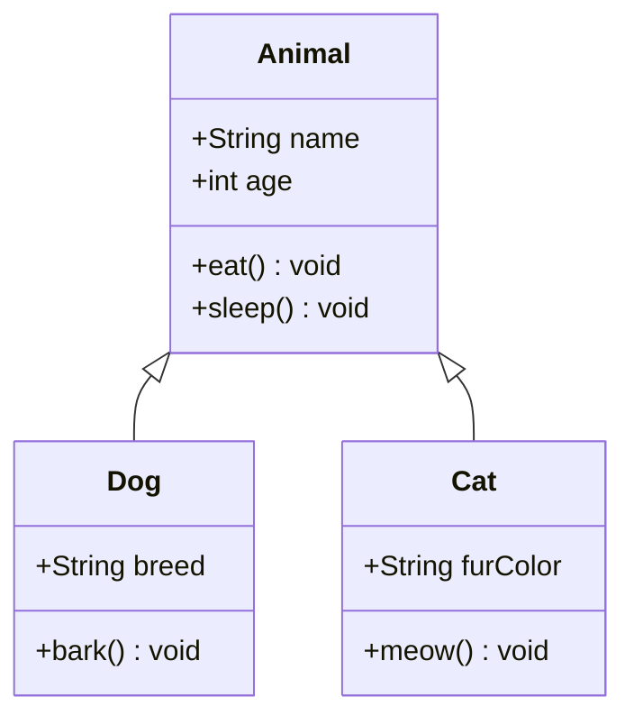
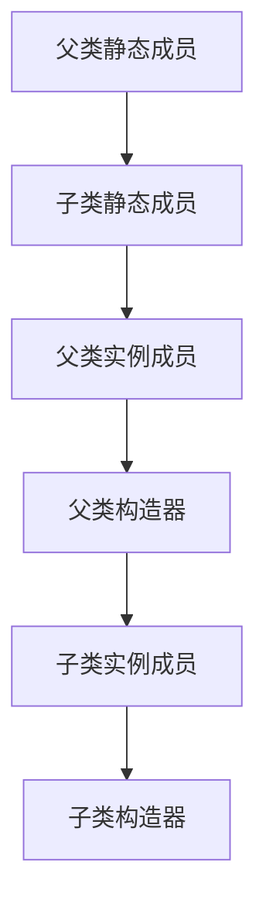

# Java 继承机制深度总结

## 一、继承基本概念


**继承定义**：子类（派生类）继承父类（基类）的属性和方法，实现代码复用和层次化设计。

**核心特性**：
- **代码复用**：子类自动获得父类的非私有成员
- **扩展性**：子类可添加新属性和方法
- **多态基础**：子类可重写父类方法
- **单继承**：Java只支持单继承（一个子类只能有一个直接父类）

## 二、继承语法与实现

### 1. 基本语法
```java
// 父类
public class Animal {
    protected String name;
    
    public void eat() {
        System.out.println(name + "正在进食");
    }
}

// 子类
public class Dog extends Animal {  // 使用extends关键字
    private String breed;
    
    public void bark() {
        System.out.println(name + "汪汪叫");  // 直接访问父类属性
    }
}
```

### 2. 对象创建与使用
```java
Dog myDog = new Dog();
myDog.name = "大黄";  // 使用父类属性
myDog.eat();         // 调用父类方法
myDog.bark();        // 调用子类特有方法
```

## 三、方法重写（Override）

### 1. 重写规则
```java
public class Animal {
    public void makeSound() {
        System.out.println("动物发出声音");
    }
}

public class Cat extends Animal {
    @Override  // 使用注解明确表示重写
    public void makeSound() {  // 方法签名必须相同
        System.out.println("喵喵喵");  // 重写实现
    }
}
```

**重写要求**：
- 方法名、参数列表相同
- 返回类型相同或是父类返回类型的子类（协变返回类型）
- 访问权限不能比父类更严格
- 不能抛出比父类更宽泛的检查异常

### 2. @Override 注解
- 编译器检查是否正确重写
- 提高代码可读性
- 避免拼写错误导致意外重载

## 四、super 关键字

### 1. 访问父类成员
```java
public class Bird extends Animal {
    private String featherColor;
    
    public void display() {
        super.eat();  // 调用父类方法
        System.out.println("羽毛颜色: " + featherColor);
    }
}
```

### 2. 调用父类构造器
```java
public class Employee {
    private String name;
    private double salary;
    
    public Employee(String name, double salary) {
        this.name = name;
        this.salary = salary;
    }
}

public class Manager extends Employee {
    private double bonus;
    
    public Manager(String name, double salary, double bonus) {
        super(name, salary);  // 必须放在第一行
        this.bonus = bonus;
    }
}
```

**构造器调用规则**：
- 子类构造器必须调用父类构造器
- 默认调用`super()`（父类无参构造）
- 父类没有无参构造时，必须显式调用`super(...)`

## 五、访问控制与继承

### 访问权限表
| 修饰符    | 类内 | 同包 | 不同包子类 | 其他 |
|-----------|------|------|------------|------|
| private   | ✓    | ✗    | ✗          | ✗    |
| 默认      | ✓    | ✓    | ✗          | ✗    |
| protected | ✓    | ✓    | ✓          | ✗    |
| public    | ✓    | ✓    | ✓          | ✓    |

**继承可见性**：
- 子类继承父类所有非私有成员
- 私有成员可通过父类公共方法间接访问
- protected成员在不同包子类中可见

## 六、Object 类：所有类的父类

### 常用方法
| 方法               | 说明                     | 通常需要重写 |
|--------------------|--------------------------|--------------|
| `toString()`       | 返回对象字符串表示       | ✓            |
| `equals(Object o)` | 比较对象内容是否相等     | ✓            |
| `hashCode()`       | 返回对象哈希码           | ✓            |
| `getClass()`       | 返回运行时类对象         | ✗            |
| `clone()`          | 创建并返回对象副本       | ✗            |
| `finalize()`       | 垃圾回收前调用（已弃用） | ✗            |

**重写示例**：
```java
public class Person {
    private String id;
    private String name;
    
    @Override
    public boolean equals(Object o) {
        if (this == o) return true;
        if (o == null || getClass() != o.getClass()) return false;
        Person person = (Person) o;
        return Objects.equals(id, person.id);
    }
    
    @Override
    public int hashCode() {
        return Objects.hash(id);
    }
    
    @Override
    public String toString() {
        return "Person{" + "id='" + id + '\'' + ", name='" + name + '\'' + '}';
    }
}
```

## 七、继承中的初始化顺序


**示例代码**：
```java
class Parent {
    static { System.out.println("父类静态代码块"); }
    { System.out.println("父类实例代码块"); }
    Parent() { System.out.println("父类构造器"); }
}

class Child extends Parent {
    static { System.out.println("子类静态代码块"); }
    { System.out.println("子类实例代码块"); }
    Child() { System.out.println("子类构造器"); }
}

// 测试
public class Test {
    public static void main(String[] args) {
        new Child();
    }
}
/* 输出：
父类静态代码块
子类静态代码块
父类实例代码块
父类构造器
子类实例代码块
子类构造器
*/
```

## 八、继承设计原则

### 1. 里氏替换原则（LSP）
> **子类对象必须能够替换父类对象，且程序行为不变**

**正确实践**：
```java
// 父类
class Bird {
    public void fly() {
        System.out.println("飞行");
    }
}

// 子类符合LSP
class Eagle extends Bird { /* 重写飞行方法 */ }

// 错误示例（违反LSP）
class Penguin extends Bird {
    @Override
    public void fly() {
        throw new UnsupportedOperationException("企鹅不会飞！");
    }
}
```

### 2. 组合优于继承
```java
// 使用组合替代继承
class Engine {
    public void start() { /* 启动逻辑 */ }
}

class Car {
    private Engine engine;  // 组合关系
    
    public void start() {
        engine.start();
    }
}

// 替代错误继承
class Car extends Engine { }  // 不合理的继承关系
```

## 九、抽象类与继承

### 抽象类特点
1. 用`abstract`修饰
2. 可以包含抽象方法（无实现）
3. 不能实例化
4. 子类必须实现所有抽象方法

```java
abstract class Shape {
    protected String color;
    
    public Shape(String color) {
        this.color = color;
    }
    
    // 抽象方法
    public abstract double area();
    
    // 具体方法
    public String getColor() {
        return color;
    }
}

class Circle extends Shape {
    private double radius;
    
    public Circle(String color, double radius) {
        super(color);
        this.radius = radius;
    }
    
    @Override
    public double area() {
        return Math.PI * radius * radius;
    }
}
```

## 十、常见问题与陷阱

### 1. 错误重载 vs 正确重写
```java
class Parent {
    public void process(String s) { /* ... */ }
}

class Child extends Parent {
    // ❌ 错误：这是重载不是重写
    public void process(Integer i) { /* ... */ }
    
    // ✅ 正确重写
    @Override
    public void process(String s) { /* ... */ }
}
```

### 2. 构造器调用错误
```java
public class Child extends Parent {
    private int value;
    
    public Child(int value) {
        // ❌ 编译错误：super()必须是第一句
        this.value = value;
        super(); 
    }
}
```

### 3. 意外隐藏静态方法
```java
class Parent {
    public static void staticMethod() {
        System.out.println("父类静态方法");
    }
}

class Child extends Parent {
    // ❌ 不是重写，是方法隐藏
    public static void staticMethod() {
        System.out.println("子类静态方法");
    }
}
```

## 十一、最佳实践总结

1. **谨慎使用继承**：只在"is-a"关系时使用（Dog is an Animal）
2. **避免深度继承**：继承层次不超过3层
3. **遵守LSP原则**：子类应完全支持父类行为
4. **优先使用组合**：特别是当关系为"has-a"时（Car has an Engine）
5. **合理使用抽象类**：为相关类提供通用实现
6. **正确重写方法**：始终使用@Override注解
7. **封装变化**：将可能变化的部分放在子类中
8. **避免在构造器中调用可重写方法**

> **继承的本质**：建立类之间的层次关系，实现代码复用和多态处理。合理使用继承可以创建灵活、可维护的系统架构。