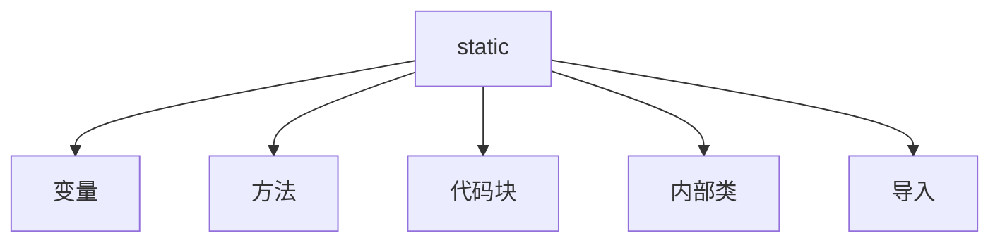
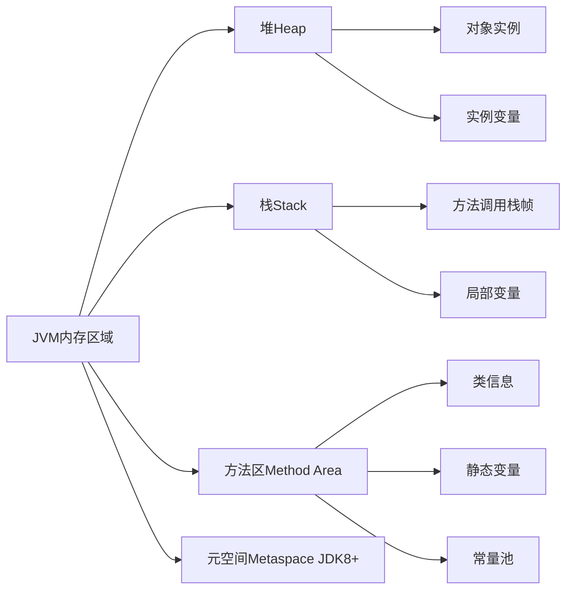

# Java `static` 关键字

## 一、核心概念
`static` 是 Java 中的**修饰符**，用于声明**类级别成员**（与对象实例无关）



## 二、static 变量（类变量）

### 特点：
- 内存中**只有一份拷贝**（所有实例共享）
- 在**类加载时**初始化
- 存储在**方法区**（JDK7 及之前）或**元空间**（JDK8+）

### 示例：
```java
public class Counter {
    // 实例变量 - 每个对象独立
    private int instanceCount = 0;
    
    // 静态变量 - 所有对象共享
    private static int staticCount = 0;
    
    public void increment() {
        instanceCount++;
        staticCount++;
    }
    
    public void print() {
        System.out.println("实例计数: " + instanceCount);
        System.out.println("静态计数: " + staticCount);
    }
}

// 测试
Counter c1 = new Counter();
c1.increment();
c1.print();  // 实例:1, 静态:1

Counter c2 = new Counter();
c2.increment();
c2.print();  // 实例:1, 静态:2
```

## 三、static 方法（类方法）

### 特点：
1. **不能访问非静态成员**（实例变量/方法）
2. **不能使用 this/super** 关键字
3. 可通过**类名直接调用**
4. 常用于：
   - 工具类方法（如 Math.sqrt()）
   - 工厂方法
   - 单例模式

### 示例：
```java
public class MathUtils {
    // 静态方法
    public static double circleArea(double radius) {
        return Math.PI * radius * radius;
    }
    
    // 错误示例：尝试访问实例成员
    // public static void errorMethod() {
    //    System.out.println(instanceVar); // 编译错误
    // }
}

// 调用
double area = MathUtils.circleArea(5.0);
```

## 四、static 代码块

### 特点：
- 在**类加载时执行**（早于对象创建）
- 按声明顺序执行
- 常用于**初始化静态资源**

### 示例：
```java
public class DatabaseConfig {
    // 静态变量
    private static String dbUrl;
    private static String username;
    private static String password;
    
    // 静态代码块
    static {
        Properties props = new Properties();
        try (InputStream is = DatabaseConfig.class.getResourceAsStream("db.properties")) {
            props.load(is);
            dbUrl = props.getProperty("db.url");
            username = props.getProperty("db.username");
            password = props.getProperty("db.password");
        } catch (IOException e) {
            throw new RuntimeException("加载数据库配置失败", e);
        }
    }
}
```

## 五、static 内部类

### 特点：
1. **不依赖外部类实例**
2. **只能访问外部类的静态成员**
3. 常用于：
   - 工具类
   - Builder 模式
   - 嵌套数据结构

### 示例：
```java
public class Outer {
    private static String staticMsg = "静态消息";
    private String instanceMsg = "实例消息";
    
    // 静态内部类
    public static class StaticNested {
        public void print() {
            System.out.println(staticMsg); // 正确
            // System.out.println(instanceMsg); // 错误
        }
    }
}

// 使用
Outer.StaticNested nested = new Outer.StaticNested();
nested.print();
```

## 六、静态导入（static import）

### 特点：
- 直接导入静态成员（无需类名前缀）
- 提高代码简洁性
- 避免过度使用（降低可读性）

### 示例：
```java
// 传统方式
double root = Math.sqrt(25);
double pi = Math.PI;

// 静态导入
import static java.lang.Math.sqrt;
import static java.lang.Math.PI;

// 使用
double root = sqrt(25);
double circleArea = PI * radius * radius;
```

## 七、关键特性对比

| 特性                | 静态成员                     | 实例成员                     |
|---------------------|------------------------------|------------------------------|
| **内存分配**        | 类加载时（方法区/元空间）    | 对象创建时（堆内存）         |
| **生命周期**        | 与类相同                     | 与对象相同                   |
| **访问方式**        | 类名.成员 或 对象.成员       | 必须通过对象访问             |
| **共享性**          | 所有对象共享                 | 每个对象独立                 |
| **this/super**      | 不可用                       | 可用                         |
| **初始化时机**      | 类加载时                     | 对象创建时                   |
| **访问权限**        | 只能访问静态成员             | 可访问静态和实例成员         |

## 八、最佳实践

### 1. 正确使用场景
```java
// 工具类（所有方法静态）
public final class StringUtils {
    private StringUtils() {} // 防止实例化
    
    public static boolean isEmpty(String str) {
        return str == null || str.trim().isEmpty();
    }
    
    public static String reverse(String str) {
        return new StringBuilder(str).reverse().toString();
    }
}

// 常量定义
public class Constants {
    public static final double TAX_RATE = 0.15;
    public static final int MAX_CONNECTIONS = 100;
}

// 单例模式
public class Singleton {
    private static Singleton instance;
    
    private Singleton() {}
    
    public static Singleton getInstance() {
        if (instance == null) {
            instance = new Singleton();
        }
        return instance;
    }
}
```

### 2. 避免的常见错误
```java
// 反例1：在静态方法中访问实例成员
public class ErrorExample {
    private int instanceVar;
    
    public static void staticMethod() {
        // System.out.println(instanceVar); // 编译错误
    }
}

// 反例2：滥用静态变量导致线程安全问题
public class Counter {
    public static int count; // 非线程安全
    
    // 应使用AtomicInteger或同步机制
}
```

## 九、内存模型解析



- **静态变量**：存储在方法区（JDK7 及之前）或元空间（JDK8+）
- **实例变量**：存储在堆内存的对象实例中
- **局部变量**：存储在栈内存的方法调用栈帧中

## 十、常见面试题

1. **static 变量和实例变量有什么区别？**
   - 存储位置：方法区 vs 堆内存
   - 生命周期：类加载到卸载 vs 对象创建到回收
   - 共享性：全局共享 vs 对象私有

2. **能否在静态方法中访问非静态成员？为什么？**
   - 不能，因为非静态成员需要对象实例存在，而静态方法调用时可能没有对象实例

3. **静态方法能否被重写？**
   - 静态方法**没有重写**的概念（属于静态绑定/编译时绑定）
   - 子类可以声明同名静态方法，但这是**方法隐藏**（method hiding），不是重写

4. **main 方法为什么必须是 static 的？**
   - 因为 JVM 调用 main 方法时还没有创建任何对象实例
   - 确保程序的入口点独立于对象实例存在

5. **静态代码块和构造代码块执行顺序？**
   ```java
   public class Example {
       static { System.out.println("静态代码块"); }
       
       { System.out.println("构造代码块"); }
       
       public Example() { System.out.println("构造方法"); }
       
       public static void main(String[] args) {
           new Example();
       }
   }
   ```
   **输出顺序**：
   1. 静态代码块（类加载时）
   2. 构造代码块（对象创建时）
   3. 构造方法（对象创建时）