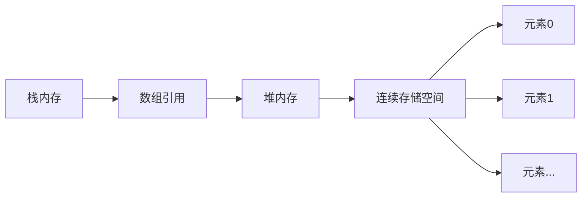

# Java 数组全面解析

## 一、数组的定义与初始化

### 1. 数组声明格式
```java
// 推荐格式
int[] array1;   // 整型数组
String[] array2; // 字符串数组

// C语言风格（不推荐）
int array3[];
```

### 2. 静态初始化
```java
// 完整格式
int[] numbers = new int[]{1, 2, 3, 4, 5};

// 简化格式（最常用）
String[] names = {"Alice", "Bob", "Charlie"};
double[] prices = {19.99, 29.99, 9.99};

// 二维数组静态初始化
int[][] matrix = {{1, 2, 3}, {4, 5, 6}, {7, 8, 9}};
```

### 3. 动态初始化
```java
// 创建指定长度的数组
int[] scores = new int[5]; // 5个元素的整型数组
boolean[] flags = new boolean[3]; // 3个元素的布尔数组

// 二维数组动态初始化
int[][] grid = new int[3][4]; // 3行4列的二维数组
```

### 4. 默认初始化值
| 数据类型       | 默认值         | 说明                     |
|----------------|---------------|--------------------------|
| 整型（byte, short, int, long） | 0           |                          |
| 浮点型（float, double）        | 0.0          |                          |
| 字符型（char）                 | `'\u0000'`   | Unicode空字符（显示为空格） |
| 布尔型（boolean）              | `false`      |                          |
| 引用类型（类、接口、数组等）     | `null`       | 表示没有引用任何对象       |

## 二、数组操作详解

### 1. 访问与赋值
```java
int[] numbers = new int[3];

// 赋值
numbers[0] = 10;
numbers[1] = 20;
numbers[2] = 30;

// 访问
System.out.println(numbers[1]); // 输出: 20

// 修改值
numbers[1] = 25;
System.out.println(numbers[1]); // 输出: 25
```

### 2. 数组长度获取
```java
String[] fruits = {"Apple", "Banana", "Orange"};
System.out.println(fruits.length); // 输出: 3

// 循环中获取长度
for (int i = 0; i < fruits.length; i++) {
    System.out.println(fruits[i]);
}
```

### 3. 数组遍历方式

#### (1) 标准 for 循环
```java
int[] values = {5, 10, 15, 20};
for (int i = 0; i < values.length; i++) {
    System.out.println("索引 " + i + ": " + values[i]);
}
```

#### (2) 增强 for 循环（foreach）
```java
String[] colors = {"Red", "Green", "Blue"};
for (String color : colors) {
    System.out.println(color);
}
```

#### (3) 使用 Arrays.toString()
```java
import java.util.Arrays;

int[] data = {1, 2, 3, 4, 5};
System.out.println(Arrays.toString(data)); 
// 输出: [1, 2, 3, 4, 5]
```

### 4. 常见数组操作

#### 数组求和
```java
int sum = 0;
for (int num : numbers) {
    sum += num;
}
System.out.println("总和: " + sum);
```

#### 查找最大值
```java
int max = numbers[0];
for (int i = 1; i < numbers.length; i++) {
    if (numbers[i] > max) {
        max = numbers[i];
    }
}
System.out.println("最大值: " + max);
```

#### 数组反转
```java
int[] reverse = new int[numbers.length];
for (int i = 0, j = numbers.length - 1; i < numbers.length; i++, j--) {
    reverse[j] = numbers[i];
}
System.out.println("反转数组: " + Arrays.toString(reverse));
```

## 三、数组内存模型

### 1. 内存分配原理


### 2. 代码示例分析
```java
int[] arr1 = {10, 20, 30}; // 静态初始化
int[] arr2 = new int[3];    // 动态初始化
arr2[0] = 100;
arr2[1] = 200;

int[] arr3 = arr1; // 引用赋值
arr3[0] = 999;     // 修改会影响arr1
```

## 四、多维数组

### 1. 二维数组定义
```java
// 静态初始化
int[][] matrix1 = {
    {1, 2, 3},
    {4, 5, 6},
    {7, 8, 9}
};

// 动态初始化
int[][] matrix2 = new int[3][4]; // 3行4列
```

### 2. 不规则数组
```java
// 创建不规则二维数组
int[][] jaggedArray = new int[3][];
jaggedArray[0] = new int[2]; // 第一行2列
jaggedArray[1] = new int[3]; // 第二行3列
jaggedArray[2] = new int[4]; // 第三行4列

// 赋值
jaggedArray[0][0] = 1;
jaggedArray[0][1] = 2;
jaggedArray[1][0] = 3;
// ... 其他元素赋值
```

### 3. 多维数组遍历
```java
// 嵌套循环遍历二维数组
for (int i = 0; i < matrix1.length; i++) {
    for (int j = 0; j < matrix1[i].length; j++) {
        System.out.print(matrix1[i][j] + " ");
    }
    System.out.println();
}

// 增强for循环遍历
for (int[] row : matrix1) {
    for (int num : row) {
        System.out.print(num + " ");
    }
    System.out.println();
}
```

## 五、数组工具类 Arrays

### 1. 常用方法
```java
import java.util.Arrays;

int[] numbers = {5, 2, 8, 1, 9};

// 数组排序
Arrays.sort(numbers); // [1, 2, 5, 8, 9]

// 二分查找（需先排序）
int index = Arrays.binarySearch(numbers, 8); // 3

// 数组填充
int[] filled = new int[5];
Arrays.fill(filled, 10); // [10, 10, 10, 10, 10]

// 数组比较
int[] arr1 = {1, 2, 3};
int[] arr2 = {1, 2, 3};
boolean equal = Arrays.equals(arr1, arr2); // true

// 数组复制
int[] copy = Arrays.copyOf(numbers, 3); // [1, 2, 5]
```

### 2. 数组转列表
```java
String[] fruits = {"Apple", "Banana", "Orange"};
List<String> fruitList = Arrays.asList(fruits);

// 注意：此列表是固定大小的
// fruitList.add("Grape"); // 会抛出 UnsupportedOperationException
```

## 六、数组使用注意事项

### 1. 常见错误
```java
// 1. 索引越界
int[] arr = new int[3];
// System.out.println(arr[3]); // ArrayIndexOutOfBoundsException

// 2. 空指针异常
int[] nullArr = null;
// System.out.println(nullArr[0]); // NullPointerException

// 3. 长度错误
int size = 5;
// int[] wrong = new int[-5]; // NegativeArraySizeException
```

### 2. 最佳实践
1. **长度检查**：访问数组元素前检查索引有效性
   ```java
   if (index >= 0 && index < array.length) {
       // 安全访问
   }
   ```

2. **数组复制**：需要真正复制数组时使用 `Arrays.copyOf()`
   ```java
   int[] original = {1, 2, 3};
   int[] copy = Arrays.copyOf(original, original.length);
   ```

3. **对象数组**：引用类型数组的元素默认为 `null`
   ```java
   String[] names = new String[3];
   if (names[0] != null) {
       System.out.println(names[0].length());
   }
   ```

## 七、数组与集合的转换

### 1. 数组转集合
```java
String[] array = {"A", "B", "C"};

// 方法1：Arrays.asList()（固定大小）
List<String> fixedList = Arrays.asList(array);

// 方法2：使用ArrayList构造器（可变大小）
List<String> dynamicList = new ArrayList<>(Arrays.asList(array));
```

### 2. 集合转数组
```java
List<String> list = new ArrayList<>();
list.add("X");
list.add("Y");
list.add("Z");

// 方法1：toArray() 无参方法（返回Object[]）
Object[] objArray = list.toArray();

// 方法2：toArray() 带类型参数
String[] strArray = list.toArray(new String[0]);
```

## 八、数组性能考虑

### 1. 访问效率
- 数组在内存中连续存储，支持O(1)时间复杂度的随机访问
- 访问元素 `array[i]` 的计算：`内存地址 = 首地址 + i * 元素大小`

### 2. 与集合比较
| 特性         | 数组                     | ArrayList               |
|--------------|--------------------------|-------------------------|
| 大小         | 固定                     | 动态可变                |
| 内存使用     | 更紧凑                   | 有额外开销              |
| 随机访问     | O(1)                     | O(1)                   |
| 插入/删除    | O(n)（需移动元素）       | O(n)                   |
| 类型安全     | 编译时检查               | 泛型提供运行时类型安全  |
| 多维支持     | 原生支持                 | 需嵌套集合              |
