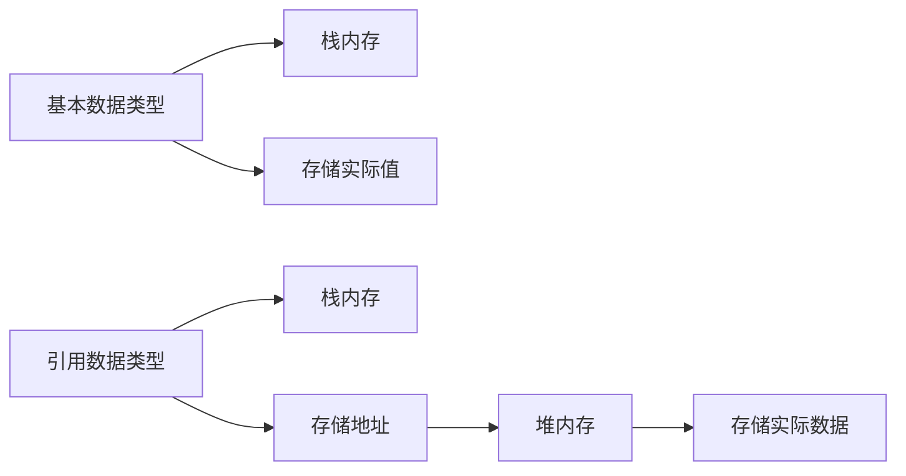

# Java 基础概念全面整理笔记

## 一、注释详解

### 1. 单行注释：`//`
```java
// 这是单行注释，用于解释单行代码
int age = 25; // 声明一个年龄变量
```

### 2. 多行注释：`/* */`
```java
/*
 * 这是多行注释
 * 可以跨越多行
 * 常用于方法说明或代码块解释
 */
```

### 3. 文档注释：`/** */`
```java
/**
 * 计算两个数的和
 * @param a 第一个加数
 * @param b 第二个加数
 * @return 两数之和
 */
public int add(int a, int b) {
    return a + b;
}
```

**文档注释补充**：
- 可通过 `javadoc` 工具生成 API 文档
- 常用标签：
  - `@author`：作者信息
  - `@version`：版本信息
  - `@see`：参考链接
  - `@since`：起始版本
  - `@throws`：抛出异常说明

## 二、关键字详解

### 1. 关键字特点
- 全部小写
- 在 IDE 中通常显示特殊颜色
- 不能用作标识符

### 2. class 关键字
```java
// class 关键字用于定义类
public class HelloWorld {
    // 类体
}
```

**常见关键字分类**：
| 类别         | 关键字示例                     |
|--------------|-------------------------------|
| 访问控制     | public, private, protected   |
| 类、方法、变量| class, interface, enum       |
| 数据类型     | int, boolean, char, void     |
| 流程控制     | if, else, switch, case       |
| 循环         | for, while, do               |
| 异常处理     | try, catch, finally, throw  |

## 三、字面量详解

### 1. 整数类型
```java
int count = 100;       // 十进制
int binary = 0b1101;   // 二进制 (13)
int octal = 017;       // 八进制 (15)
int hex = 0x1F;        // 十六进制 (31)
```

### 2. 小数类型
```java
double price = 19.99;  // 双精度浮点数
float rate = 0.05F;    // 单精度浮点数（必须加F后缀）
```

### 3. 字符串类型
```java
String message = "Hello, Java!";
```

### 4. 字符类型
```java
char letterA = 'A';    // 字母
char digit = '7';      // 数字
char chinese = '中';   // 汉字
char tab = '\t';       // 制表符
```

**特殊字符补充**：
| 转义序列 | 含义            | 示例                          |
|----------|----------------|-------------------------------|
| `\t`     | 制表符          | `System.out.println("a\tb");` |
| `\n`     | 换行符          | `System.out.println("第一行\n第二行");` |
| `\\`     | 反斜杠          | `System.out.println("路径：C:\\Programs");` |
| `\"`     | 双引号          | `System.out.println("他说：\"你好\"");` |
| `\'`     | 单引号          | `char quote = '\'';`          |
| `\uXXXX` | Unicode字符     | `char omega = '\u03A9';` // Ω |

### 5. 布尔类型
```java
boolean isJavaFun = true;
boolean isFishMammal = false;
```

### 6. 空类型
```java
String name = null;  // 引用类型变量可赋值为null

// 不能直接打印null，需要转换为字符串
System.out.println("值为: " + null);
```

## 四、变量详解

### 1. 变量声明与初始化
```java
// 声明变量
int age;

// 初始化变量
age = 25;

// 声明并初始化
double height = 1.75;
```

### 2. 注意事项
- **只能存一个值**：变量是单一值的容器
- **不允许重复定义**：
  ```java
  int count = 10;
  // int count = 20; // 错误！变量名重复定义
  ```
- **一条语句定义多个变量**：
  ```java
  int x = 5, y = 10, z = 15;
  ```
- **使用前必须赋值**：
  ```java
  int total;
  // System.out.println(total); // 错误！未初始化
  total = 100; // 正确初始化
  ```

**变量作用域补充**：
```java
public class ScopeExample {
    int classLevel = 10; // 类级变量（成员变量）
    
    public void method() {
        int methodLevel = 20; // 方法级变量
        
        if (true) {
            int blockLevel = 30; // 块级变量
            System.out.println(blockLevel);
        }
        
        // System.out.println(blockLevel); // 错误！超出作用域
    }
}
```

## 五、计算机存储系统

### 1. 数值表示法
```java
int binary = 0b1010;   // 二进制 10
int octal = 012;        // 八进制 10
int decimal = 10;       // 十进制 10
int hex = 0xA;          // 十六进制 10
```

### 2. 数据存储原理
- **图片存储**：每个像素点由RGB值组成
  ```java
  // 表示红色像素
  int redPixel = 0xFF0000; // 十六进制表示
  ```
- **声音存储**：通过采样量化波形
  ```java
  // 假设的声音采样值
  short[] soundSamples = {0, 1024, 2048, 1024, 0, -1024};
  ```

## 六、数据类型详解

### (一) 基本数据类型

| 类型     | 关键字  | 大小    | 范围                                      | 默认值   | 示例                |
|----------|---------|--------|------------------------------------------|----------|---------------------|
| 字节型   | byte    | 1字节  | -128 ~ 127                               | 0        | `byte b = 100;`     |
| 短整型   | short   | 2字节  | -32768 ~ 32767                           | 0        | `short s = 1000;`   |
| 整型     | int     | 4字节  | -2^31 ~ 2^31-1 (约±21亿)                 | 0        | `int i = 100000;`   |
| 长整型   | long    | 8字节  | -2^63 ~ 2^63-1                           | 0L       | `long l = 100L;`    |
| 单精度   | float   | 4字节  | 约±3.4e38（有效位数6-7位）               | 0.0f     | `float f = 3.14f;`  |
| 双精度   | double  | 8字节  | 约±1.7e308（有效位数15位）               | 0.0      | `double d = 3.14;`  |
| 字符型   | char    | 2字节  | 0 ~ 65535（Unicode字符）                 | '\u0000' | `char c = 'A';`     |
| 布尔型   | boolean | 未定义 | true/false                               | false    | `boolean flag = true;` |

**类型转换规则**：
- 小类型自动转大类型（隐式转换）
- 大类型转小类型需强制转换（显式转换）
```java
int num = 100;
double bigNum = num; // 自动转换

double pi = 3.14159;
int intPi = (int) pi; // 强制转换，结果为3
```

### (二) 引用数据类型
```java
String name = "Alice"; // 字符串类型
int[] scores = {90, 85, 95}; // 数组类型
Scanner scanner = new Scanner(System.in); // 对象类型
```

**内存分配对比**：


## 七、标识符规范

### 1. 硬性要求
```java
// 有效标识符
String userName;
int $count;
double _value;
long MAX_SIZE;

// 无效标识符
int 2ndPlace; // 不能以数字开头
float public; // 不能是关键字
String user name; // 不能包含空格
```

### 2. 软性建议（命名约定）
- **类名**：大驼峰式（UpperCamelCase）
  ```java
  public class StudentManager {}
  ```
  
- **方法/变量名**：小驼峰式（lowerCamelCase）
  ```java
  public void calculateTotalPrice() {}
  private int studentCount;
  ```
  
- **常量名**：全大写+下划线分隔（SNAKE_CASE）
  ```java
  final double PI_VALUE = 3.14159;
  static final int MAX_CONNECTIONS = 100;
  ```
  
- **包名**：全小写，域名反写
  ```java
  package com.example.project;
  ```

## 八、键盘录入详解

### 完整使用流程
```java
import java.util.Scanner;

public class InputExample {
    public static void main(String[] args) {
        // 1. 创建Scanner对象
        Scanner sc = new Scanner(System.in);
        
        // 2. 提示用户输入
        System.out.print("请输入整数：");
        int num = sc.nextInt();
        
        System.out.print("请输入浮点数：");
        double price = sc.nextDouble();
        
        // 消耗换行符
        sc.nextLine(); 
        
        System.out.print("请输入字符串：");
        String name = sc.nextLine();
        
        System.out.print("请输入单个字符：");
        char gender = sc.next().charAt(0);
        
        // 3. 关闭Scanner（程序结束时）
        sc.close();
        
        // 4. 使用输入的数据
        System.out.println("输入结果：");
        System.out.println("整数：" + num);
        System.out.println("浮点数：" + price);
        System.out.println("字符串：" + name);
        System.out.println("字符：" + gender);
    }
}
```

### 输入类型方法总结
| 方法                 | 返回类型 | 说明                          |
|----------------------|----------|-------------------------------|
| `nextInt()`          | int      | 读取整数                      |
| `nextDouble()`       | double   | 读取双精度浮点数              |
| `nextFloat()`        | float    | 读取单精度浮点数              |
| `nextLong()`         | long     | 读取长整数                    |
| `nextShort()`        | short    | 读取短整数                    |
| `nextByte()`         | byte     | 读取字节                      |
| `nextBoolean()`      | boolean  | 读取布尔值                    |
| `next()`             | String   | 读取单个单词（空格分隔）      |
| `nextLine()`         | String   | 读取整行文本（包括空格）      |
| `next().charAt(0)`   | char     | 读取单个字符                  |

## 九、格式化输出详解

### 1. String.format() 使用
```java
// 控制小数位数
String piStr = String.format("π ≈ %.3f", Math.PI);
System.out.println(piStr); // 输出：π ≈ 3.142

// 拼接文本与变量
String info = String.format("姓名：%s，年龄：%d，成绩：%.1f", "张三", 20, 92.5);
System.out.println(info);

// 控制对齐方式
String header = String.format("| %-10s | %10s | %10s |", "项目", "单价", "数量");
System.out.println(header);
```

### 2. printf() 方法
```java
// 直接格式化输出
System.out.printf("当前时间：%tT%n", new Date());

// 数字格式化
System.out.printf("十进制：%d，十六进制：%x，八进制：%o%n", 100, 100, 100);

// 货币格式化
System.out.printf("总价：%,.2f 元%n", 1234567.89);
```

### 3. 格式化符号详解
| 格式化符号 | 说明                           | 示例                                  |
|------------|--------------------------------|---------------------------------------|
| `%d`       | 十进制整数                     | `String.format("%d", 100)` → "100"    |
| `%f`       | 浮点数                         | `String.format("%.2f", 3.14159)` → "3.14" |
| `%s`       | 字符串                         | `String.format("%s", "Java")` → "Java"|
| `%c`       | 字符                           | `String.format("%c", 'A')` → "A"      |
| `%b`       | 布尔值                         | `String.format("%b", true)` → "true"  |
| `%n`       | 平台无关的换行符               |                                       |
| `%%`       | 百分号本身                     | `String.format("%d%%", 80)` → "80%"   |
| `%t`       | 日期时间（需配合子格式）       | `%tH:%tM:%tS` → 14:30:45             |
| `,`        | 千位分隔符                     | `%,d` → 1,000,000                    |
| `-`        | 左对齐                         | `%-10s` → 左对齐10字符宽度            |
| `0`        | 数字前补零                     | `%05d` → 00123                       |

## 十、键盘录入高级处理

### 1. 混合输入问题解决方案
```java
Scanner sc = new Scanner(System.in);

System.out.print("请输入整数：");
int num = sc.nextInt();

// 解决方案1：消耗换行符
sc.nextLine(); // 关键行！

System.out.print("请输入字符串：");
String text = sc.nextLine();

// 解决方案2：统一使用nextLine()
System.out.print("请输入另一个整数：");
int num2 = Integer.parseInt(sc.nextLine());
```

### 2. 类型转换方法
```java
// 字符串转整数
int count = Integer.parseInt("100");

// 字符串转浮点数
double price = Double.parseDouble("19.99");

// 字符串转布尔值
boolean isValid = Boolean.parseBoolean("true");

// 字符串转长整型
long bigNumber = Long.parseLong("123456789012");
```

### 3. 输入验证模式
```java
Scanner sc = new Scanner(System.in);
int age = 0;

while (true) {
    System.out.print("请输入年龄(0-120)：");
    String input = sc.nextLine();
    
    try {
        age = Integer.parseInt(input);
        if (age >= 0 && age <= 120) {
            break; // 输入有效，退出循环
        } else {
            System.out.println("年龄必须在0-120之间，请重新输入！");
        }
    } catch (NumberFormatException e) {
        System.out.println("输入的不是有效数字，请重新输入！");
    }
}

System.out.println("您输入的年龄是：" + age);
```

### 4. 高级输入处理技巧
```java
// 读取多个值
System.out.print("请输入三个数字（空格分隔）：");
String[] numbers = sc.nextLine().split(" ");
double sum = 0;
for (String numStr : numbers) {
    sum += Double.parseDouble(numStr);
}
System.out.println("总和：" + sum);

// 读取CSV文件式输入
System.out.print("请输入学生信息（姓名,年龄,成绩）：");
String[] studentData = sc.nextLine().split(",");
String name = studentData[0];
int age = Integer.parseInt(studentData[1]);
double score = Double.parseDouble(studentData[2]);
```
