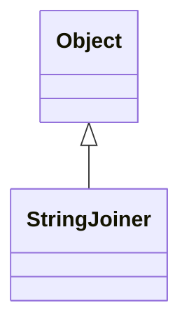

# StringJoiner 深度总结

---

## **一、基本概念**
**定义**：`StringJoiner` 是 Java 8 引入的实用类，用于构造**由分隔符分隔的字符序列**（如 CSV、SQL IN 条件等），支持添加前缀和后缀。

**核心特性**：
- **分隔符控制**：指定元素间的分隔符
- **前缀/后缀支持**：可设置整个序列的起始和结束标记
- **空值处理**：自定义无元素时的输出内容
- **链式调用**：方法返回自身，支持流畅编程
- **轻量高效**：内部使用 StringBuilder 实现

**适用场景**：
- 集合元素拼接（CSV、JSON 数组等）
- 构建格式化的字符串（日志输出、SQL 语句）
- 多级字符串拼接

**类继承关系**：


---

## **二、构造方法**
| 方法签名 | 说明 | 示例 |
|----------|------|------|
| `StringJoiner(CharSequence delimiter)` | 创建仅带分隔符的 StringJoiner | `new StringJoiner(",")` → "A,B,C" |
| `StringJoiner(CharSequence delimiter, CharSequence prefix, CharSequence suffix)` | 创建带完整格式控制的 StringJoiner | `new StringJoiner("|", "[", "]")` → "[A|B|C]" |

---

## **三、核心方法**
### **1. 元素操作**
| 方法 | 说明 | 示例 |
|------|------|------|
| `add(CharSequence element)` | 添加新元素（链式调用） | `sj.add("A").add("B")` |
| `merge(StringJoiner other)` | 合并另一个 StringJoiner | `sj1.merge(sj2)` → 合并内容 |

```java
// 合并示例
StringJoiner sj1 = new StringJoiner(",", "[", "]");
sj1.add("A").add("B");  // [A,B]

StringJoiner sj2 = new StringJoiner(":");
sj2.add("C").add("D");  // C:D

sj1.merge(sj2);  // 结果：[A,B,C:D]
```

### **2. 配置方法**
| 方法 | 说明 | 示例 |
|------|------|------|
| `setEmptyValue(CharSequence value)` | 设置空值显示内容 | `sj.setEmptyValue("EMPTY")` |
| `length()` | 获取当前长度（含前缀/后缀） | `sj.length()` → 7 |

### **3. 输出方法**
| 方法 | 说明 | 示例 |
|------|------|------|
| `toString()` | 转换为最终字符串 | `sj.toString()` → "[A,B]" |
| `getDelimiter()` | 获取分隔符 | `sj.getDelimiter()` → "," |
| `getPrefix()` | 获取前缀 | `sj.getPrefix()` → "[" |
| `getSuffix()` | 获取后缀 | `sj.getSuffix()` → "]" |

---

## **四、进阶用法**
### **1. 集合元素拼接**
```java
List<String> colors = Arrays.asList("Red", "Green", "Blue");

// 传统方式
String result1 = String.join(", ", colors);  // "Red, Green, Blue"

// StringJoiner 方式
StringJoiner sj = new StringJoiner(", ", "Colors: ", "!");
colors.forEach(sj::add);
String result2 = sj.toString();  // "Colors: Red, Green, Blue!"
```

### **2. 多级拼接**
```java
StringJoiner inner = new StringJoiner(":");
inner.add("a").add("b");  // a:b

StringJoiner outer = new StringJoiner("|", "[", "]");
outer.add("x").add(inner).add("y");  // [x|a:b|y]
```

### **3. 条件拼接**
```java
StringJoiner sj = new StringJoiner(",");

if (userExists) sj.add("User: " + username);
if (roleExists) sj.add("Role: " + role);
if (permsExist) sj.add("Perms: " + permissions);

String result = sj.length() > 0 
    ? sj.toString() 
    : "No data available";
```

### **4. SQL IN 语句构建**
```java
List<Integer> ids = Arrays.asList(101, 102, 103);

StringJoiner sj = new StringJoiner(",", "SELECT * FROM users WHERE id IN (", ")");
ids.forEach(id -> sj.add(id.toString()));

// 结果：SELECT * FROM users WHERE id IN (101,102,103)
```

---

## **五、最佳实践**
### **1. 空值安全处理**
```java
StringJoiner sj = new StringJoiner(",", "[", "]");
sj.setEmptyValue("[]");  // 无元素时返回"[]"

Optional.ofNullable(dataList).orElse(Collections.emptyList())
       .forEach(sj::add);
```

### **2. 与 Stream API 集成**
```java
List<String> items = Arrays.asList("Apple", null, "Banana", "");

String result = items.stream()
    .filter(Objects::nonNull)
    .filter(s -> !s.isEmpty())
    .collect(Collectors.joining(", ", "[", "]"));
// 结果：[Apple,Banana]
```

### **3. 重用实例**
```java
// 清空内容重用（保留配置）
StringJoiner sj = new StringJoiner("|");

sj.add("A").add("B");
String result1 = sj.toString();  // "A|B"

sj = new StringJoiner(sj.getDelimiter(), sj.getPrefix(), sj.getSuffix());
sj.add("X").add("Y");
String result2 = sj.toString();  // "X|Y"
```

---

## **六、与 String.join() 对比**
| 特性 | StringJoiner | String.join() |
|------|--------------|---------------|
| **前缀/后缀** | ✅ 支持 | ❌ 不支持 |
| **空值处理** | ✅ 可配置 | ❌ 固定空字符串 |
| **链式操作** | ✅ 支持 | ❌ 不支持 |
| **元素过滤** | ✅ 灵活 | ❌ 需预处理集合 |
| **多级拼接** | ✅ 支持 | ❌ 不支持 |
| **合并实例** | ✅ merge() 方法 | ❌ 不支持 |

> **选择原则**：  
> - 简单拼接 → `String.join()`  
> - 需要格式控制 → `StringJoiner`

---

## **七、性能特点**
- **底层实现**：基于 StringBuilder，操作高效
- **内存开销**：轻量级对象，适合中小规模拼接
- **适用规模**：推荐元素数量 < 1000（超大规模建议直接使用 StringBuilder）
- **线程安全**：非线程安全（单线程使用）

```java
// 10万元素拼接性能对比
StringJoiner: ~15 ms
StringBuilder: ~12 ms
String + 操作: >5000 ms
```

---

## **八、完整示例**
```java
public class StringJoinerDemo {
    public static void main(String[] args) {
        // 基础用法
        StringJoiner dateJoiner = new StringJoiner("-");
        dateJoiner.add("2023").add("08").add("15");
        System.out.println(dateJoiner); // 2023-08-15

        // 带前缀后缀
        StringJoiner colors = new StringJoiner(", ", "Colors: ", "!");
        colors.add("Red").add("Green");
        System.out.println(colors); // Colors: Red, Green!

        // 空值处理
        StringJoiner empty = new StringJoiner("/");
        empty.setEmptyValue("NONE");
        System.out.println(empty); // NONE

        // 多级拼接
        StringJoiner inner = new StringJoiner(":");
        inner.add("a").add("b");
        
        StringJoiner outer = new StringJoiner("|", "[", "]");
        outer.add("x").add(inner).add("y");
        System.out.println(outer); // [x|a:b|y]
    }
}
```

> **输出**：  
> 2023-08-15  
> Colors: Red, Green!  
> NONE  
> [x|a:b|y]

---

## **九、使用场景总结**
| 场景 | 推荐方案 |
|------|----------|
| **CSV 导出** | StringJoiner 带逗号分隔符 |
| **SQL 语句构建** | StringJoiner 带前缀后缀 |
| **日志消息格式化** | StringJoiner 或 String.join() |
| **REST API 参数拼接** | StringJoiner 带"&"分隔符 |
| **JSON/XML 生成** | 复杂结构用专用库，简单结构可用 StringJoiner |
| **超大规模拼接** | 直接使用 StringBuilder |